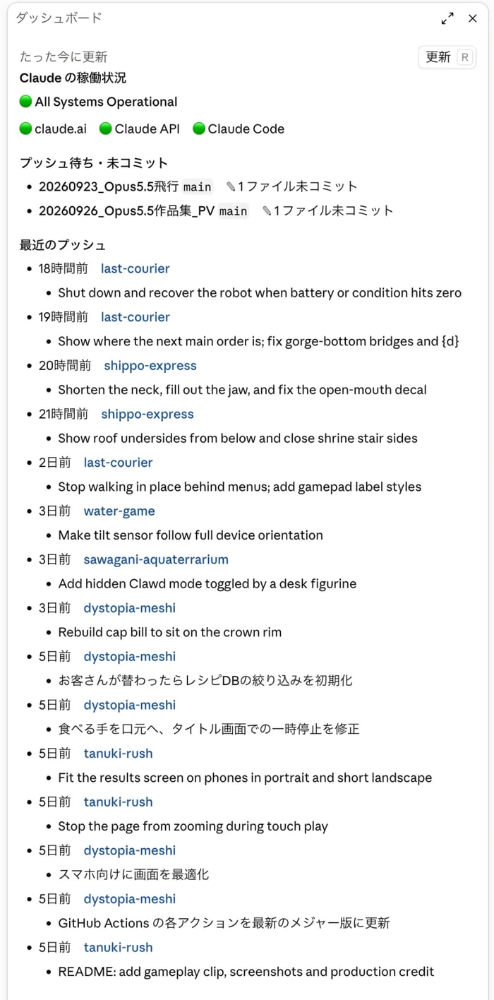
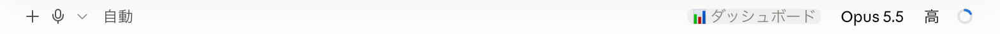

# dev-dashboard

Claude Code のデスクトップアプリで、セッションの横に Claude の稼働状況と GitHub への最近のプッシュを並べる mod。

[](https://code.claude.com/docs/en/plugins/mods/overview)
[](https://www.anthropic.com/claude)
[](./LICENSE)

<p align="center">
  
</p>

**Claude Code × Claude Opus 5.5（HIGH）** で作りました。

Claude Code のアプリを開くと、画面の右側がけっこう空いています。そこで、セッションを開いたら横にパネルが出て、「いま Claude は落ちていないか」「最近どのリポジトリに何をプッシュしたか」がひと目で分かるようにしました。プッシュごとにコミットメッセージも並ぶので、昨日どこまで進めたかを思い出す手がかりにもなります。

## 表示するもの

| 欄 | 内容 |
| --- | --- |
| Claude の稼働状況 | [status.claude.com](https://status.claude.com) の全体の状態と、claude.ai・Claude API・Claude Code それぞれの状態（🟢🟡🟠🔴🔧）。障害やメンテナンスが進行中なら、その件名をリンク付きで並べる |
| プッシュ待ち・未コミット | ホームフォルダ直下の git リポジトリのうち、未プッシュのコミット、未コミットのファイル、上流ブランチのないブランチがあるもの。**該当があるときだけ**出る |
| 最近のプッシュ | GitHub への最近のプッシュ 15 件。リポジトリ名（リンク）、何分前か、main / master 以外ならブランチ名、各プッシュのコミットメッセージ（3 件まで、それ以上は「ほか N 件」） |

- セッションを開くとパネルが自動で開き、5 分ごとに更新されます。右上の「更新」ボタン（パネルを選んでいれば `r` キー）でもすぐ更新できます。
- パネルを閉じると、入力欄の下の右端に「📊 ダッシュボード」ボタンが出ます。押すと開き直します（`/dash` でも開けます）。

<br>
<sub>パネルを閉じたあと。入力欄の下の右端に、開き直すボタンが出ます。</sub>

画像は、実際のアプリの画面を切り出したものです。

## インストール

**動作環境**：Claude Code のデスクトップアプリ（Code タブ）。mod の仕組み（function hooks）が入った版が必要です。作者は macOS 版のデスクトップアプリ（Claude Code 2.1.286）で確かめました。「最近のプッシュ」には [GitHub CLI](https://cli.github.com/)（`gh`）にログインしていることが必要です。

ターミナルで次の 2 行を実行します。

```bash
claude plugin marketplace add tanuu5/dev-dashboard
```

```bash
claude plugin install dev-dashboard@dev-dashboard
```

入れたあと、新しいセッションを開くと右側にパネルが出ます。外すときは `/plugin` の画面で無効にするか、`claude plugin uninstall dev-dashboard@dev-dashboard` を実行します。

### この mod がすること・しないこと

mod は Claude Code の中で、あなたの権限のまま動きます。入れる前に中身を確かめてください。

- フックするイベント：`session.start`（パネルを開く）、`command.run`（`/dash`）、`ui.close`（このパネルが閉じられたことを知る）、`ui.render`（このパネルと、入力欄の下のモード表示 `SessionMode` に開き直すボタンを足すだけ）
- 通信先：`status.claude.com`（稼働状況の公開 API）と、`gh api` 経由の GitHub API（自分のイベント一覧と、各プッシュの比較）
- 実行するコマンド：`find`（ホームフォルダ直下 2 階層の `.git` を探す。`~/Library` は除く）、`git status` と `git remote`（読み取りだけ）、`gh api`（読み取りだけ）
- ファイルの書き込み、リポジトリの変更、別モデルへの問い合わせはしません。会話やツールの実行には手を出しません。

## 制作について

企画・ディレクション：**たぬ**　／　開発：**Claude Code（Claude Opus 5.5・推論レベル HIGH）**

最初は、アプリを開いたときのホーム画面（「次は何をしましょうか？」の画面）の空きスペースに出したいと考えました。しかし、mod が動くのはセッションの中だけで、ホーム画面には描けません。そこで、セッションの横に開くパネル（Pane）にしました。閉じたあとに開き直す入口として、入力欄の下のモード表示の並びにボタンを足しています。中身は mod の `Markdown` 要素で描いているので、見出し・リンク・箇条書きがアプリの返答と同じ見た目になります。最初の版にあった GitHub の稼働状況とローカルの最近のコミットは、個人開発ではコミットとプッシュがほぼセットになることから外し、そのぶんプッシュの欄を厚くしました。

## 更新履歴

- **2026-10-02**：公開

## 開発

```text
.claude-plugin/marketplace.json        マーケットプレイスの定義
plugins/dev-dashboard/
  .claude-plugin/plugin.json           mod の定義
  hooks/hooks.json                     読み込むモジュール
  hooks/register.tsx                   本体（データ集め、Markdown の組み立て、パネルの描画）
  types/index.d.ts                     $.state に置く値の型
```

手元の版を直接読み込むには、`claude --plugin-dir ./plugins/dev-dashboard` で起動します。起動フラグを渡せないデスクトップアプリでは、`~/.claude/settings.json` の `env` に `CLAUDE_CODE_PLUGIN_DIRS` として、このフォルダの絶対パスを書きます（複数の mod を並べるときは `:` で区切ります）。

```bash
claude plugin validate ./plugins/dev-dashboard
```

型を確かめるには、mod を一度読み込ませて型定義（`.claude-plugin/types/`）を書き出させてから、`npx -p typescript tsc -p plugins/dev-dashboard/tsconfig.json` を実行します。

## クレジット・ライセンス

- MIT License（[LICENSE](LICENSE)）© 2026 たぬ
- 稼働状況は [Claude Status](https://status.claude.com) の公開 API から取得しています。この mod は Anthropic とは関係のない個人の作品です。
- MIT License の対象はこのリポジトリのコードと文章です。「Claude」の名前や商標の使用を許諾するものではありません。
